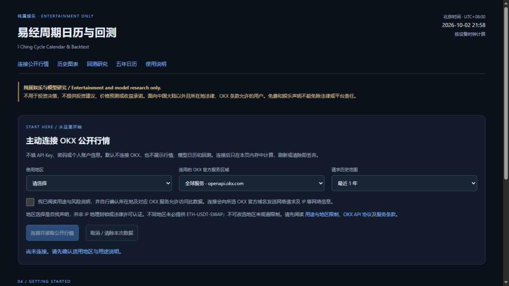
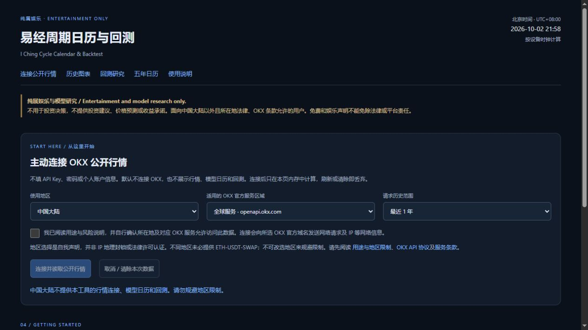
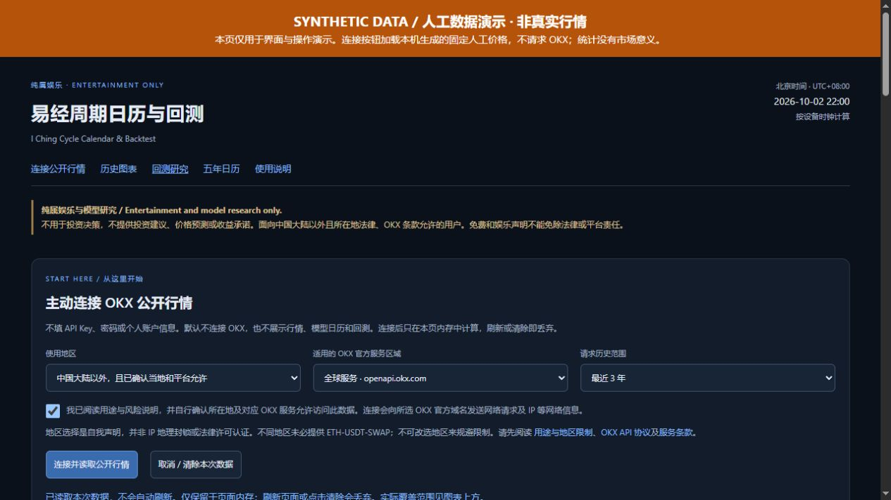

# v0.2.0 quick start: read first, then actively connect

[Project](../README.en.md) · [中文](QUICKSTART.zh-CN.md) · [Website](https://biaogebaofu.github.io/iching-cycle-backtest/) · [Use boundaries](RISK_NOTICE.md)

**For entertainment and model research only. Do not use it for investment decisions. Free, without referral commissions.**

## 1. Understand the empty startup page

The initial page contains purpose, region, and connection notices only. It makes no default OKX request, bundles no real prices, and automatically displays no direction, backtest, or calendar. Do not enter passwords, accounts, or API keys.

Computers, tablets, and phones use the same browser page. The interface is mainly Chinese, supported by bilingual documentation. Python, Node.js, and Git are unnecessary.

## 2. Declare your own region and eligibility

Read the notices and [use boundaries](RISK_NOTICE.md) before personally making truthful region and purpose declarations.

Under “使用地区” (use location), truthfully choose your status. Only “中国大陆以外，且已确认当地和平台允许” (outside mainland China, with local and platform eligibility confirmed), together with your own notice acknowledgment, enables an active connection. “中国大陆” (mainland China), “其他受限地区 / 尚未确认” (other restricted location / not confirmed), and “请选择” (select a status) do not.

- No connection is available before a region selection.
- Mainland China and other restricted locations cannot use data access.
- Another region selection is not a legal or OKX eligibility approval. You must establish your own eligibility.
- This is self-declaration, not IP blocking or legal certification. Do not use proxies or false declarations to bypass restrictions.

Free access, entertainment use, and unauthenticated access do not establish data permission. Stop without connecting if unsure.

## 3. Actively connect to public prices

Only if eligible and aware of the purpose and data conditions, operate these controls yourself:

1. “适用的 OKX 官方服务区域” (applicable official service region): choose the service applicable to you—global, US / Australia, or EEA. Do not switch to an inapplicable region to resolve failures. A service may not provide ETH-USDT-SWAP.
2. “请求历史范围” (requested history): choose the last 90 days, 1 year, or 3 years; the default is 1 year. This is a target, not guaranteed coverage.
3. Read the purpose, risks, and official terms yourself. Check the acknowledgment only if it truthfully applies to you.
4. Press “连接并读取公开行情” (connect and read public prices). During loading, “取消 / 清除本次数据” (cancel / clear this session) stops the request.

Your browser sends read-only GET requests directly to the selected official OKX domain. No API key is entered here, and the connection does not log in, read private positions, or place orders.

After loading, read the **actual session range, candle count, and cutoff**. The old bundled snapshot no longer defines coverage. The latest prices are not guaranteed to have loaded completely. Network, region, CORS, or other errors stop loading; there is no proxy or fallback to old prices or documentation's synthetic data.

There is no continuous automatic data refresh. Loading is user-initiated. After refresh, check the conditions yourself before actively reconnecting.

## 4. Read the interface after success

Charts and the time calendar appear only after successful connection. **Backtest results additionally require pressing “运行回测”.** Dates use Beijing time, UTC+08:00, with the current time supplied by your device clock. Calendar cards say “模型正向（假设）” (hypothetical positive model direction) or “模型反向（假设）” (hypothetical inverse model direction), solely to explain the fixed rules.

| Chinese control | Meaning |
| --- | --- |
| 图1 / 日线范围 | Main and daily chart range. |
| 图2范围 | Recent second-chart range. |
| 未来信号 | Future formula signals; no future actual prices. |
| 重绘图表 | Redraw charts. |
| 展开日线与最近 2H 图表 | Expand daily and recent 2H charts. |
| 回测口径 | Select one of the two separate research methods. |
| 起始日期（北京时间） / 结束日期（含） | Start and inclusive end dates, within the prices actually loaded. |
| 单边成本（bps） | Hypothetical fees and slippage per side. |
| 运行回测 | Run the hypothetical statistics; run again after changing dates or costs. |

Chart ranges and backtest dates are separate. 2H means a two-hour candle: the price is its close, while the horizontal timestamp is its opening.

### Read the methods separately

| Method | Hypothetical calculation |
| --- | --- |
| 方向日历 · 中点切换基准 — midpoint baseline | A red high-band midpoint selects short, green deep-band selects long. Enter at the close of the first 2H candle opening at or after the midpoint; exit at the next opposite event's associated close. Positions before the selected start are not carried in. |
| 原 Bias · 固定持有统计 — fixed holding periods | Calculate bias at candle opening. Above +0.1 selects long and below −0.1 short; the middle and boundary values generate no sample. Compare the entry candle's close with closes 2, 6, 12, 24, 72, or 168 hours later. |

The bias chart uses red-long and green-short. Calendar midpoint events use red-short and green-long. Do not combine their directions or statistics. All direction labels are entertainment-model outputs, not an investment basis.

## 5. Use the synthetic illustration to learn the labels

**This image uses synthetic data, not OKX prices or real market performance.** It explains how to read the interface. The public application does not automatically load this documentation demonstration. It is not bundled market data or evidence of predictive ability.

After a successful real connection, choose the method, dates within the fetched coverage, and hypothetical cost, then press “运行回测”. Inadequate coverage can produce no completed samples.

### Cost settings do not charge you

One bps is 0.01%. Entering 5 bps assumes 0.05% per side and deducts 0.10% from a completed round trip. An unfinished midpoint segment deducts only its hypothetical entry cost. Zero reproduces gross statistics. This input does not make a payment.

Funding, leverage, margin, liquidation, and actual execution are not modeled. A linear short return can be below −100%; it is not an account that could necessarily sustain and complete that position.

| Result | Interpretation |
| --- | --- |
| 已完成样本 / 样本数 | Verifiable completed samples actually included. |
| 扣成本胜率 | Completed samples with strictly positive return after hypothetical cost; zero is not a win. |
| 单样本平均 / 扣成本平均 | Arithmetic mean after costs, potentially affected by extreme samples. |
| 单样本中位数 / 扣成本中位数 | Middle level after sorting the returns. |
| 毛收益 / 平均毛收益 | Directional return before modeled cost, or its mean. |
| 未完成 · 快照估值 | An unfinished midpoint segment marked at the last available close within the cutoff; excluded from completed-sample statistics. |
| 缺失事件跳过 / 缺口跳过 | Missing exact entry/exit candles or gapped fixed-holding windows; skipped, not zero-return samples. |
| — | May indicate no completed sample, rather than zero return. |

Fixed-holding samples can overlap. Do not add or compound them into an equity curve, combine horizons or methods, or infer annualized returns. Means, medians, and win rates are hypothetical statistics, not future-profit evidence. Closing prices alone cannot provide intraperiod maximum adverse excursion (MAE).

The calendar retains the original time formula. Current, next, and future phases are entertainment-research outputs, not future-price predictions. Read the displayed window, inclusive effective times, and exclusive end times.

## 6. Clear, refresh, and use the local package

Press “取消 / 清除本次数据” (cancel / clear this session) or refresh. This button also cancels an ongoing request. Prices and calculations live in current page memory, are discarded on clearing or refresh, and the research content is hidden. They are not automatically saved as price files or written to the public repository.

Download the official ZIP from [Releases](https://github.com/biaogebaofu/iching-cycle-backtest/releases), extract it completely, and open index.html with assets and docs in place. You can read the interface and documents locally. **No real prices are preinstalled.** Real data and subsequent displays still require eligibility and an active online connection. Without a network or when blocked, real-data research is unavailable. Phone bookmarks or home-screen shortcuts do not guarantee offline use.

## Common situations

| Situation | Action |
| --- | --- |
| No charts or directions on startup | Expected empty state. They appear only after an eligible, active, successful connection. |
| No region selected, or restricted location declared | Stop. Do not use false declarations or a circumvention proxy. |
| Network or CORS error | Loading stops. Do not bypass it; connectivity alone is not eligibility. |
| Data disappear after refresh | Expected: session prices exist only in memory. |
| No completed samples | Check fetched coverage and selected dates; do not substitute the synthetic illustration for real data. |
| You want to share | Share official source or notice links, without unauthorized publication of OKX prices, real-price images, or data packages. |

All rights reserved; see [LICENSE](../LICENSE). This guide does not establish removal of old Git commits, screenshots, or releases. Reports must exclude accounts, keys, personal information, and complete market-data dumps.
