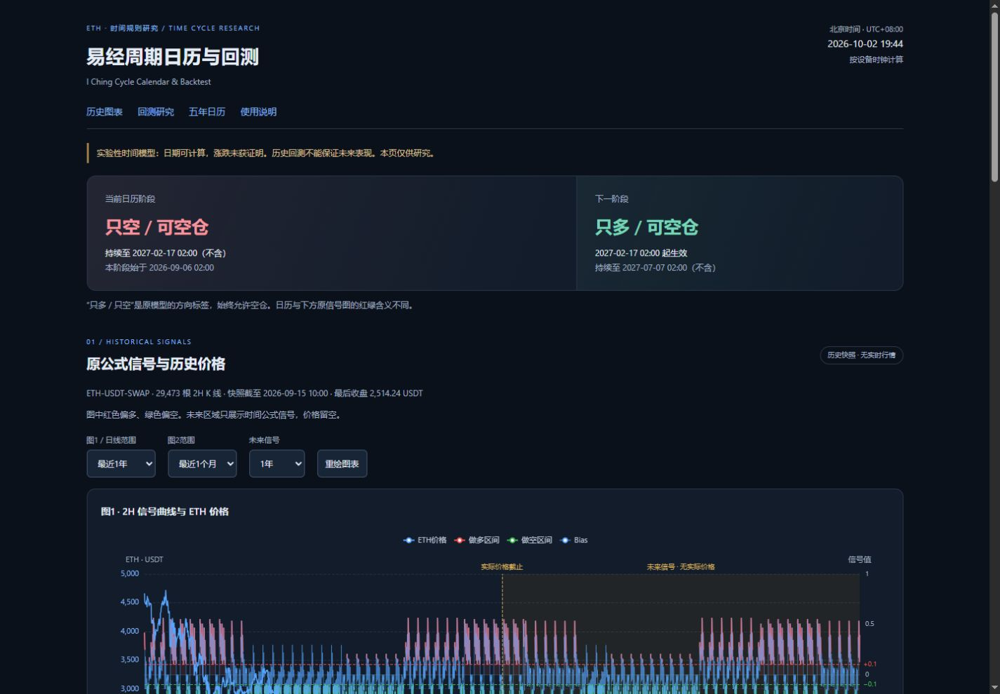
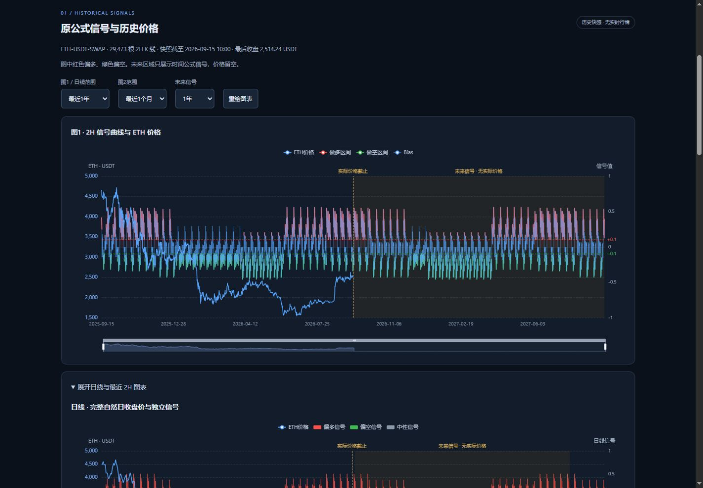
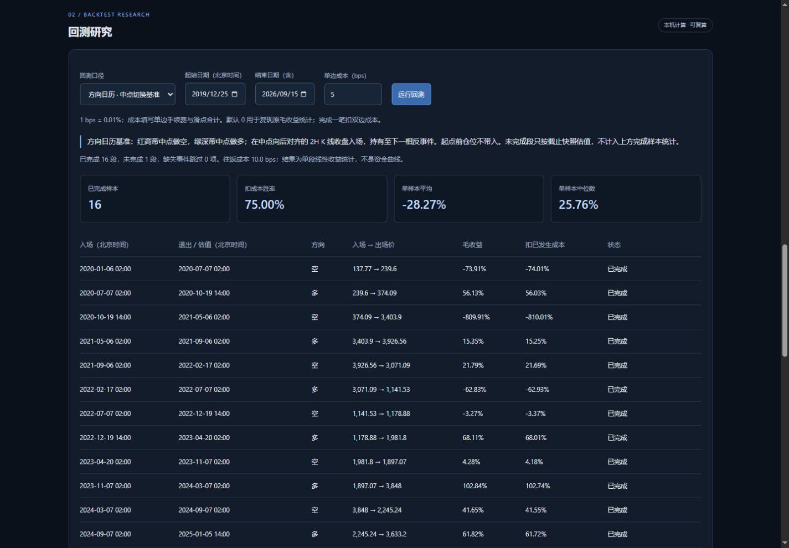
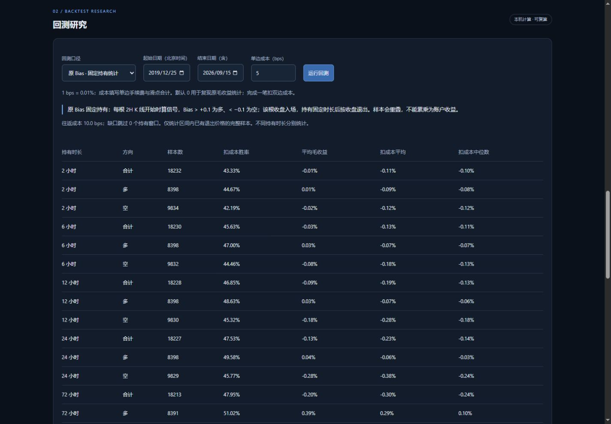
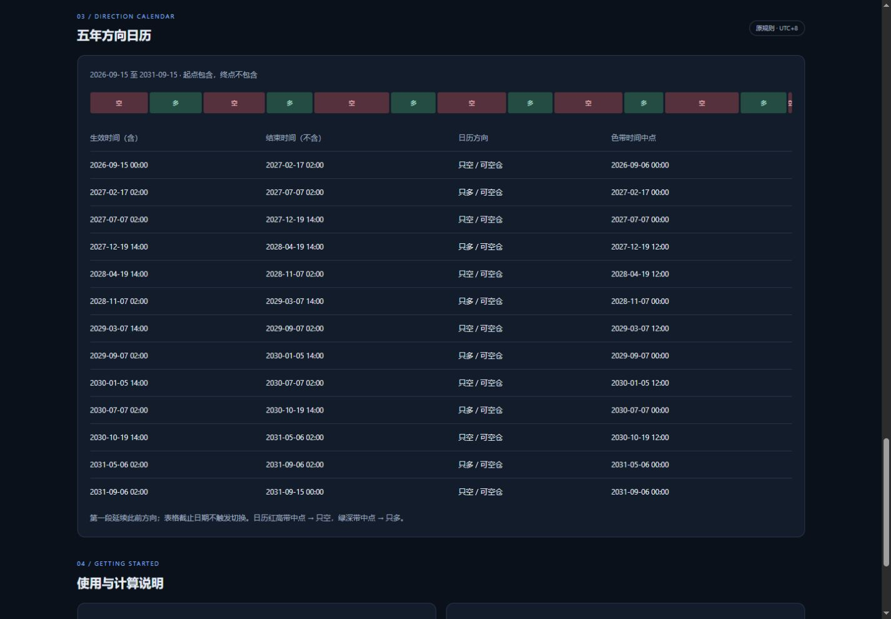
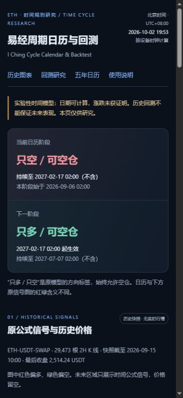
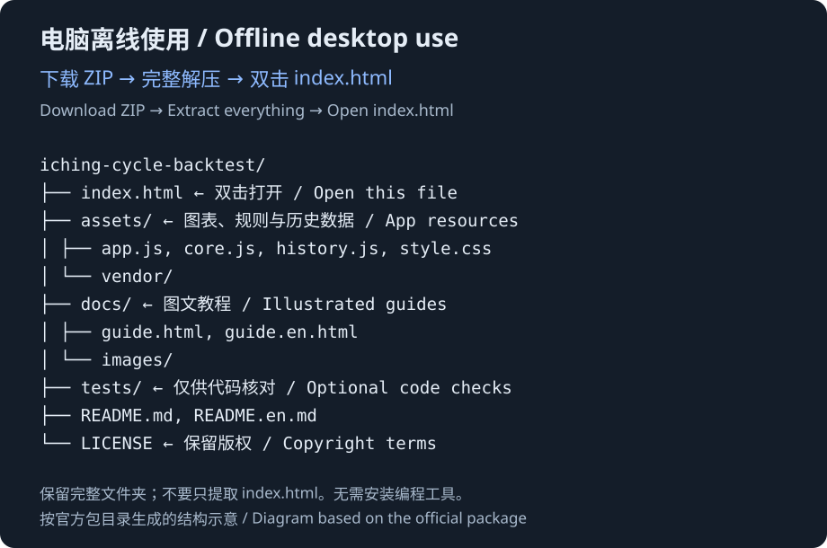

# 图文快速上手：不需要懂程序

[返回项目说明](../README.md) · [English](QUICKSTART.en.md) · [在线使用](https://biaogebaofu.github.io/iching-cycle-backtest/) · [浏览器图文教程](https://biaogebaofu.github.io/iching-cycle-backtest/docs/guide.html)

用浏览器即可查看日历和运行回测，不需要注册、连接交易账户或安装编程工具。下面按页面的真实按钮名称操作。回测截图统一使用**全部历史、单边成本 5 bps**，便于复现；网页默认成本是 0。

## 1. 打开网页，先看日期与阶段

打开[易经周期日历与回测](https://biaogebaofu.github.io/iching-cycle-backtest/)，在顶部查看“当前日历阶段”和“下一阶段”。

- **时间统一为北京时间，UTC+08:00。** 即使你在其他时区，页面里的日历和回测日期也按北京时间显示。当前阶段根据设备时钟换算，请保持设备日期和时间准确。
- **“只多 / 只空”是原模型方向标签。** 始终允许空仓，它不是要求你下单。
- **真实行情截至 2026-09-15 10:00（北京时间）。** 页面时钟和未来日历会继续推进，但历史行情快照不自动更新。

数据为 `ETH-USDT-SWAP` 的 29,473 根 2 小时 K 线，原页面标注来源 OKX，本次未逐根向交易所重新核验。模型有效性尚未证明。详见[数据说明](DATA.md)。

## 2. 调整图表，分清价格和信号

点顶部“历史图表”，在“原公式信号与历史价格”区域操作。

1. 在“图1 / 日线范围”选择“全部历史”“最近1年”“最近半年”或“最近3个月”。
2. 在“图2范围”选择最近 3 个月、1 个月或 2 周。
3. 在“未来信号”选择展示时长；想只看历史，可以选“不展示”。
4. 点“重绘图表”可重新绘制。点击“展开日线与最近 2H 图表”可查看日线和图2。
5. 拖动图底滑条，缩放想看的区间。手机也可缩小日期范围来减少文字拥挤。

`2H` 表示 2 小时。图中价格取每根 K 线的收盘值，横轴对应它的开始时间；日线只使用完整北京时间自然日。快照末日之后没有真实价格，未来区域只有时间公式信号。

**红绿含义要分别阅读：**

| 区域 | 红色 | 绿色 |
| --- | --- | --- |
| 原 Bias 信号图及固定持有统计 | 偏多，Bias 高于 `+0.1` | 偏空，Bias 低于 `−0.1` |
| 方向日历的带状中点规则 | 红高带中点切换为“只空” | 绿深带中点切换为“只多” |

图表范围与回测日期是两个独立设置。只改图表显示范围，不会改变回测选定的历史区间。

## 3. 运行“方向日历 · 中点切换基准”

点顶部“回测研究”，按以下设置复现图中的操作。

1. “回测口径”选择“方向日历 · 中点切换基准”。
2. “起始日期（北京时间）”填 `2019-12-25`；“结束日期（含）”填 `2026-09-15`。首次打开默认就是这个全部历史区间。
3. “单边成本（bps）”填 `5`。
4. 点“运行回测”。改日期或成本之后，再点一次即可重算。

这套回测在红高带中点切换为空、绿深带中点切换为多。中点向上对齐到第一根开始时间不早于它的 2 小时 K 线，以该根收盘价入场，持有到下一相反事件对应的收盘价退出。**选定起始日期之前的持仓不带入。**

### 5 bps 是多少成本

`1 bps = 0.01%`。输入的是**单边手续费与滑点合计**，5 bps 就是单边 0.05%；完成一次入场和退出，合计扣 10 bps，即 0.10%。5 bps 是教程示例，可以按自己的研究假设调整，不代表真实成交成本。

网页默认 0 用于复现原毛收益统计，并不代表交易没有成本。结果未计入资金费、杠杆、保证金或强平。

### 先看上方汇总，再看每段结果

| 页面项目 | 怎么理解 |
| --- | --- |
| 已完成样本 | 已有入场和相反方向退出价格的完整段数。先看数量，少量样本不能说明长期稳定性。 |
| 扣成本胜率 | 完成样本中，扣成本后收益**严格大于零**的比例；零收益不算胜利。 |
| 单样本平均 | 完成样本扣成本收益的算术平均；少数极端值可能拉高或拉低它。 |
| 单样本中位数 | 把完成样本扣成本收益从低到高排序后的中间值，用于观察中间水平。 |
| 毛收益 | 该段只按收盘价计算的方向收益，尚未扣手续费与滑点。 |
| 扣已发生成本 | 扣掉已发生的成本之后的收益。完整段扣双边成本；未完成段只扣已发生的单边入场成本。 |
| 未完成 · 快照估值 | 到所选截止时间尚未完成下一相反事件的退出，只按截止范围内最后可用收盘价估值，**不计入上方完成样本统计**。 |
| 缺失事件跳过 | 某次所需的入场或退出 K 线缺失、无法验证价格，该项跳过。它不等于亏损或零收益样本。 |

这张图使用单边 5 bps 成本：共有 16 段已完成样本，扣成本胜率为 75.00%，单样本平均为 −28.27%，中位数为 25.76%。少数大额亏损会拉低平均值，例如图中一段空头的扣成本线性收益为 −810.01%。这个数字来自价格比值的研究计算，不是对可执行账户亏损或净值的模拟；模型未模拟保证金和强平，因此不能仅凭高胜率判断能够盈利。

上方指标是每一段的统计，不是账户总收益或资金曲线。快照只保留时间和收盘价，因此无法计算盘中最大不利变动（MAE）。

## 4. 单独查看“原 Bias · 固定持有统计”

在同一回测区域把“回测口径”改为“原 Bias · 固定持有统计”。保留全部历史和 5 bps 成本，再点“运行回测”。

每根 2 小时 K 线开始时计算信号：Bias 高于 `+0.1` 视为多，低于 `−0.1` 视为空，中间区间不产生样本。以该根收盘价入场，再比较 2、6、12、24、72 或 168 小时后的收盘价。

表格中每个持有时长分别列出“合计 / 多 / 空”。例如想研究持有 24 小时的偏空信号，阅读“24 小时 / 空”这一行。

- “样本数”是这一行实际完成、可验证的样本数量。
- “平均毛收益”未扣成本；“扣成本平均”和“扣成本中位数”已经扣双边成本。
- “扣成本胜率”仍然只把扣成本收益严格大于零的样本算作胜利。
- “缺口跳过”统计含数据缺口的持有窗口；缺口窗口不进入结果。只统计区间内已有退出价格的完整样本。

**固定持有样本可能重叠。** 相邻两根 K 线都产生 24 小时信号时，它们的大部分持有时间相同。不能把这些收益相加或累乘成账户收益，也不能把不同持有时长的结果混合成年化收益。它回答的是“信号在固定时间后怎样表现”，与中点切换基准是两种不同口径。

## 5. 查看五年方向日历

点顶部“五年日历”，查看时间段概览和下面的表格。

日历窗口为 2026-09-15 至 2031-09-15，起点包含，终点不包含。“生效时间（含）”表示这一阶段从该时刻开始；到“结束时间（不含）”时不再属于这一段，应读取下一阶段。窗口第一段延续此前方向，表格截止日期本身不触发切换。

这些日期来自固定时间公式，不包含未来行情，也不证明未来涨跌。日历的红高带中点对应“只空”，绿深带中点对应“只多”，与原 Bias 图的红绿方向含义不同。

## 6. 手机和平板使用

在手机或平板浏览器中打开同一[在线网页](https://biaogebaofu.github.io/iching-cycle-backtest/)。

控件会根据屏幕宽度排列。长表格可以左右滑动；图表较密时，可以横屏查看或选择较短的图表范围。回测按钮和计算口径与电脑相同。

可以收藏网页，或使用浏览器提供的“添加到主屏幕”作为快捷入口。它不保证离线可用。

## 7. 电脑离线打开

1. 打开官方 [Releases 发布页](https://github.com/biaogebaofu/iching-cycle-backtest/releases)，下载官方离线 ZIP。
2. **先完整解压**到一个文件夹。不要在压缩包里面直接打开网页，也不要只取出 `index.html`。
3. 在解压后的文件夹中双击 `index.html`。如果系统询问打开方式，选择 Edge、Chrome、Firefox 或 Safari 等浏览器。
4. 保留 `assets` 等资源目录的位置，以后再次双击 `index.html` 即可使用。打开包内 `docs/guide.html` 可在浏览器阅读图文教程。

图中是**官方离线包文件结构示意**，根据真实文件列表整理，用于说明 `index.html` 和资源目录的位置。

Windows 和 macOS 都可使用，无需安装 Python、Node.js 或 Git。完整资源解压后，日历和回测在浏览器本地计算，历史行情从包内快照读取，不需要连接交易账户。离线版也不会自动补充当天行情。

## 常见情况

| 情况 | 怎么处理 |
| --- | --- |
| 离线打开后图表空白 | 确认 ZIP 已完整解压，`assets` 等资源文件未移动；重新用浏览器打开 `index.html`，并允许 JavaScript 运行。 |
| 手机图表文字比较密 | 横屏查看，或缩小“图1 / 日线范围”和“图2范围”。 |
| 没有当天行情 | 当前为静态历史快照，截止 2026-09-15 10:00（北京时间），不会自动更新。 |
| 改了日期或成本，结果没变化 | 点“运行回测”重新计算；图表范围与回测区间互不代替。 |
| 某项显示“—” | 该项可能没有可统计的完成样本；不要把缺失统计理解为零收益。 |
| 看不懂红绿颜色 | 原 Bias 图红色偏多、绿色偏空；日历中点规则红高带切空、绿深带切多。分别阅读区域说明。 |
| 想分享给别人 | 分享官方网页或仓库链接。源码与离线包的再分发需遵守[版权声明](../LICENSE)。 |

本项目保留版权，源码仅公开供查看。允许个人非商业研究使用官方网页和未经修改的官方离线包；其他使用范围见[版权声明](../LICENSE)。历史结果不证明未来可以盈利。报告问题时，请删除截图中的账户、密钥、私人仓位和个人信息。
